# PySlowFast
## 1.visualize the feature map and attention in MVit.
download the weights [K400_MVIT_B_16x4_CONV.pyth](https://github.com/zc277584121/SlowFast/blob/main/MODEL_ZOO.md) first to your project dir.
and then make sure your config file `MVIT_B_16x4_CONV.yaml` contains the layers your want to vis:
```yaml
TENSORBOARD:
  ENABLE: True
  CLASS_NAMES_PATH: "./CLASS_NAMES.json"
  MODEL_VIS:
    ENABLE: True
    MODEL_WEIGHTS: True # Set to True to visualize model weights.
    ACTIVATIONS: True # Set to True to visualize feature maps.
    INPUT_VIDEO: True # Set to True to visualize the input video(s) for the corresponding feature maps.
    LAYER_LIST:
      - blocks/0 # List of layer names to visualize weights and activations for.
      - blocks/1
      - blocks/2
      - blocks/3
      - blocks/4
      - blocks/5
      - blocks/0/attn/show_attn
      - blocks/1/attn/show_attn
      - blocks/2/attn/show_attn
      - blocks/3/attn/show_attn
      - blocks/4/attn/show_attn
      - blocks/5/attn/show_attn
```
and prepare a video. It's our demo video, and it's a clip in kinetics-400:
  
then run the command:
```python
python show_demo.py --video_path your_video.mp4 --start_sec 0 --show_img true
```
`start_sec` is the frame time second in your video.  
and you will see the output of the feature map from block/0 to block/5:
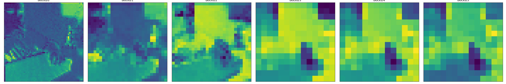
and the attn map from blocks/0/attn/show_attn to blocks/5/attn/show_attn:
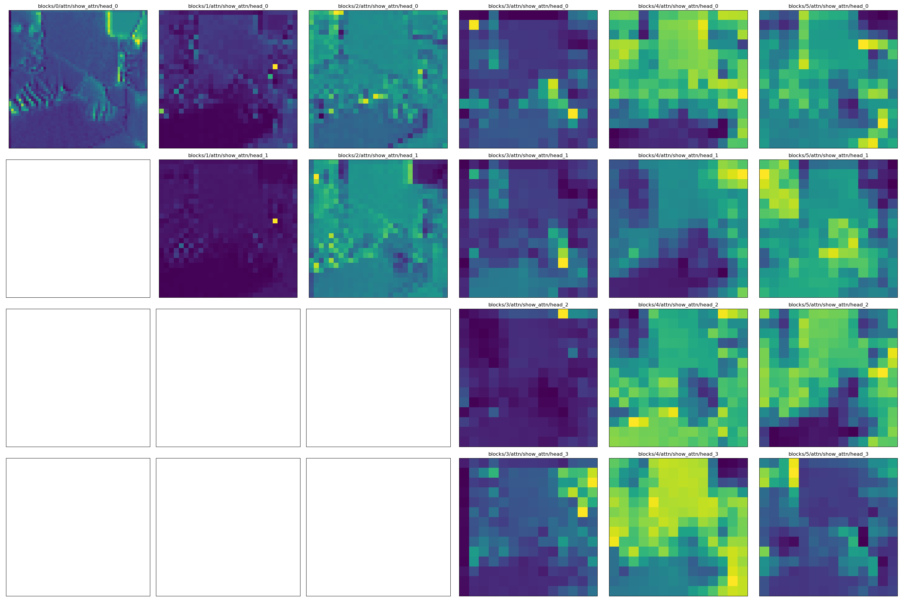
## 2 vis the video to gif
and just run this command and you will get the vis gif corresponding to your custom layer output.
```python
--video_path your_video.mp4 --start_sec 0 --end_sec 3 --sec_delta 0.2 --save_gif true
```
`start_sec` and `end_sec` correspond to your clip time second in your video.
`sec_delta` is the sample interval.
and you can get the .gif files in your projects.  
there listing some of them:   

blocks_0 feature map:  
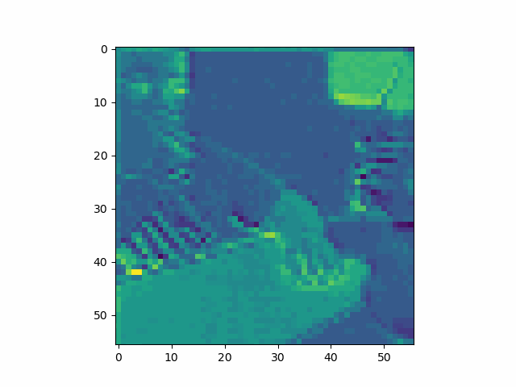

blocks_1 feature map:  
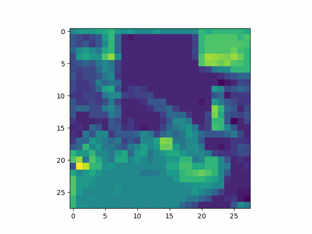

blocks_2 feature map:  
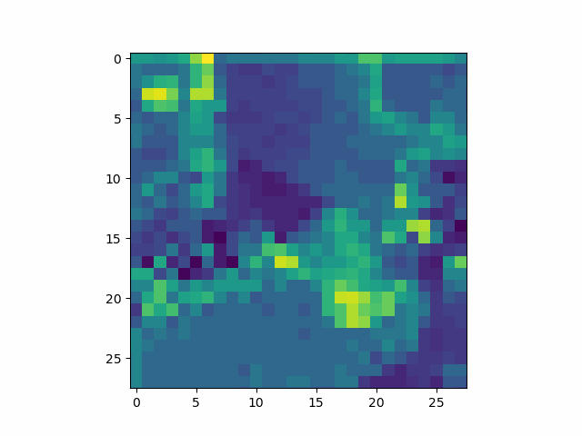

blocks_3 feature map:  
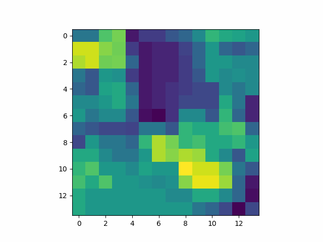

blocks_0 head_0 attention map:  
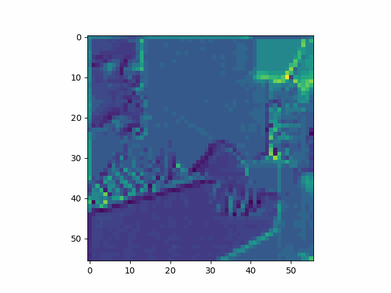

blocks_1 head_0 attention map:  
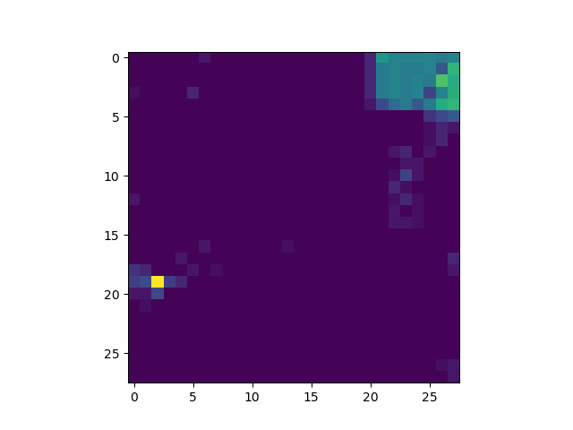

blocks_1 head_1 attention map:  
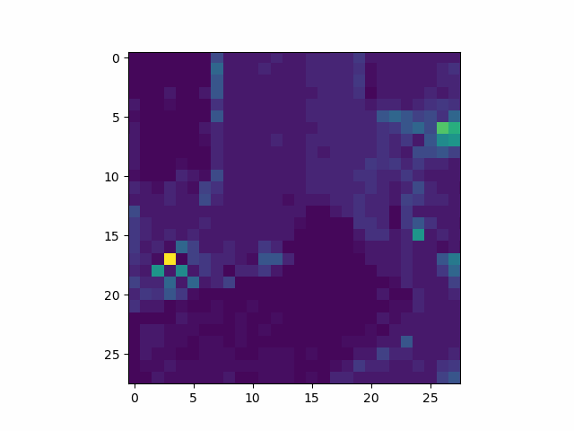

blocks_2 head_0 attention map:  
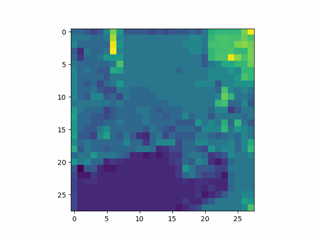

blocks_2 head_1 attention map:  
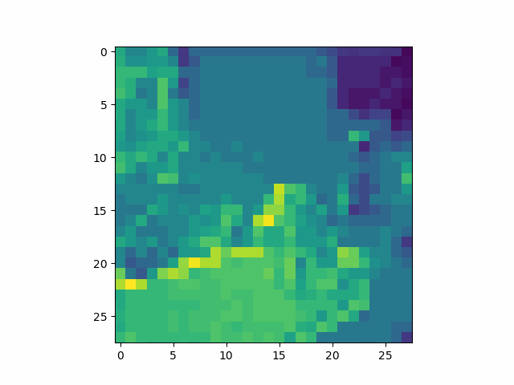
--------
# todo
#### heap map integrate
- transformer structure
[Transformer-Explainability](https://github.com/hila-chefer/Transformer-Explainability)  

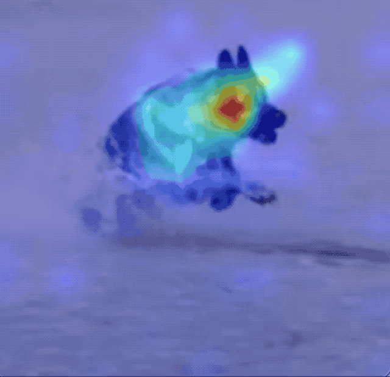
- cnn structure
[Grad-CAM](https://towardsdatascience.com/understand-your-algorithm-with-grad-cam-d3b62fce353)
#### integrate to towhee vis util
[towhee vis util](https://docs.towhee.io/fine-tune/train-operators/train-a-bird-classification-model/)


---------
This repo is forked from the commit [77bd23b3ddf25d116aaa4d75992c109917392e38](https://github.com/facebookresearch/SlowFast/commit/77bd23b3ddf25d116aaa4d75992c109917392e38) in [facebookresearch/SlowFast](https://github.com/facebookresearch/SlowFast)

Below is the original readme. 

------

# PySlowFast

PySlowFast is an open source video understanding codebase from FAIR that provides state-of-the-art video classification models with efficient training. This repository includes implementations of the following methods:

- [SlowFast Networks for Video Recognition](https://arxiv.org/abs/1812.03982)
- [Non-local Neural Networks](https://arxiv.org/abs/1711.07971)
- [A Multigrid Method for Efficiently Training Video Models](https://arxiv.org/abs/1912.00998)
- [X3D: Progressive Network Expansion for Efficient Video Recognition](https://arxiv.org/abs/2004.04730)
- [Multiscale Vision Transformers](https://arxiv.org/abs/2104.11227.pdf)

<div align="center">
  
</div>

## Introduction

The goal of PySlowFast is to provide a high-performance, light-weight pytorch codebase provides state-of-the-art video backbones for video understanding research on different tasks (classification, detection, and etc). It is designed in order to support rapid implementation and evaluation of novel video research ideas. PySlowFast includes implementations of the following backbone network architectures:

- SlowFast
- Slow
- C2D
- I3D
- Non-local Network
- X3D

## Updates
 - We now support [Multiscale Vision Transformers](https://arxiv.org/abs/2104.11227.pdf) on Kinetics and ImageNet. See [`projects/mvit`](./projects/mvit/README.md) for more information.
 - We now support [PyTorchVideo](https://github.com/facebookresearch/pytorchvideo) models and datasets. See [`projects/pytorchvideo`](./projects/pytorchvideo/README.md) for more information.
 - We now support [X3D Models](https://arxiv.org/abs/2004.04730). See [`projects/x3d`](./projects/x3d/README.md) for more information.
 - We now support [Multigrid Training](https://arxiv.org/abs/1912.00998) for efficiently training video models. See [`projects/multigrid`](./projects/multigrid/README.md) for more information.
 - PySlowFast is released in conjunction with our [ICCV 2019 Tutorial](https://alexander-kirillov.github.io/tutorials/visual-recognition-iccv19/).

## License

PySlowFast is released under the [Apache 2.0 license](LICENSE).

## Model Zoo and Baselines

We provide a large set of baseline results and trained models available for download in the PySlowFast [Model Zoo](MODEL_ZOO.md).

## Installation

Please find installation instructions for PyTorch and PySlowFast in [INSTALL.md](INSTALL.md). You may follow the instructions in [DATASET.md](slowfast/datasets/DATASET.md) to prepare the datasets.

## Quick Start

Follow the example in [GETTING_STARTED.md](GETTING_STARTED.md) to start playing video models with PySlowFast.

## Visualization Tools

We offer a range of visualization tools for the train/eval/test processes, model analysis, and for running inference with trained model.
More information at [Visualization Tools](VISUALIZATION_TOOLS.md).

## Contributors
PySlowFast is written and maintained by [Haoqi Fan](https://haoqifan.github.io/), [Yanghao Li](https://lyttonhao.github.io/), [Bo Xiong](https://www.cs.utexas.edu/~bxiong/), [Wan-Yen Lo](https://www.linkedin.com/in/wanyenlo/), [Christoph Feichtenhofer](https://feichtenhofer.github.io/).

## Citing PySlowFast
If you find PySlowFast useful in your research, please use the following BibTeX entry for citation.
```BibTeX
@misc{fan2020pyslowfast,
  author =       {Haoqi Fan and Yanghao Li and Bo Xiong and Wan-Yen Lo and
                  Christoph Feichtenhofer},
  title =        {PySlowFast},
  howpublished = {\url{https://github.com/facebookresearch/slowfast}},
  year =         {2020}
}
```
